# Compound Engineering İşleyiş Dokümanı

## 1. Tanım

Compound Engineering, AI coding agent’larıyla yazılım geliştirirken her mühendislik işinin yalnızca bir feature, bug fix veya refactor üretmesini değil; aynı zamanda sonraki işleri kolaylaştıracak yeniden kullanılabilir bilgi, test, kural, komut, dokümantasyon veya otomasyon üretmesini hedefleyen bir mühendislik yaklaşımıdır.

Temel fikir şudur:

> Her mühendislik işi, bir sonraki mühendislik işini daha kolay, daha güvenli ve daha hızlı hale getirmelidir.

Geleneksel yazılım geliştirmede her yeni feature çoğu zaman kod tabanına biraz daha karmaşıklık ekler. Compound Engineering bu eğilimi tersine çevirmeye çalışır. Bir bug fix sadece bug’ı kapatmaz; aynı bug sınıfının tekrarını önleyecek test, lint kuralı, review checklist’i, agent talimatı veya solution note üretir. Bir feature sadece UI veya backend değişikliği değildir; aynı zamanda kod tabanında gelecekte kullanılabilecek pattern’leri görünür hale getirir.

## 2. Temel felsefe

Compound Engineering’in altında üç ana varsayım vardır:

1. Kod birincil çıktı değildir; sistemi daha iyi kod üretebilir hale getiren süreç asıl kaldıraçtır.
2. Agent’a güvenmek, kör güven değildir; testler, review ajanları, planlar, PR kontrolleri ve dokümante edilmiş kararlarla güven inşa etmektir.
3. İnsan geliştiricinin işi satır satır kod yazmak değil; problemi doğru tanımlamak, iyi plan üretmek, kalite eşiğini belirlemek ve sistemin öğrenmesini sağlamaktır.

Bu yaklaşımda geliştirici “kod yazan kişi” olmaktan çok “agent filosunu yöneten, plan kalitesini belirleyen ve öğrenmeyi sisteme geri işleyen mühendis” rolüne kayar.

## 3. Zaman dağılımı

Compound Engineering’de önerilen zihinsel model:

* Zamanın büyük bölümü planlama ve review’a ayrılır.
* Kod yazma/uygulama aşaması agent’a bırakılır.
* Compound aşaması küçük görünse bile uzun vadeli getirinin merkezidir.

Pratik oran:

* Yaklaşık yüzde 80: planlama, araştırma, review, doğrulama, kalite kontrol.
* Yaklaşık yüzde 20: implementation ve öğrenmeyi sisteme geri yazma.

Bu oran, kod yazmanın artık en pahalı aşama olmadığı varsayımına dayanır. En pahalı hata yanlış plan, eksik bağlam, kötü review veya yakalanmamış pattern’dir.

## 4. Ana döngü

Compound Engineering’in sade teorik döngüsü:

```text
Plan → Work → Review → Compound → Repeat
```

Plugin pratiğinde genişletilmiş standart feature döngüsü:

```text
Ideate → Brainstorm → Plan → Work → Simplify → Review → Compound → Repeat
```

Her adımın amacı farklıdır:

| Aşama      | Amaç                                               | Ana çıktı                                           |
| ---------- | -------------------------------------------------- | --------------------------------------------------- |
| Ideate     | Ne yapılacağını bulmak                             | Sıralanmış feature / problem adayları               |
| Brainstorm | Belirsiz fikri requirements’a çevirmek             | Requirements-only plan                              |
| Plan       | Requirements’ı implementation-ready plana çevirmek | Plan dosyası                                        |
| Work       | Planı izole şekilde uygulamak                      | Kod değişiklikleri, task ilerlemesi                 |
| Simplify   | Yeni kodu sadeleştirmek                            | Daha küçük, okunabilir, tekrar kullanılabilir kod   |
| Review     | Kod ve plan uyumunu çoklu bakışla incelemek        | Önceliklendirilmiş bulgu listesi                    |
| Compound   | Öğrenmeyi sisteme geri yazmak                      | Solution note, agent talimatı, test, kural, pattern |
| Repeat     | Daha iyi bağlamla yeni işe başlamak                | Bir sonraki döngüye besleme                         |

## 5. Artifact mimarisi

Compound Engineering’de her artifact’in bir görevi vardır. Kod tek başına yeterli kabul edilmez.

Örnek proje yapısı:

```text
your-project/
├── AGENTS.md veya CLAUDE.md
│   └── Agent talimatları, proje tercihleri, mimari kurallar, stil tercihleri
│
├── STRATEGY.md
│   └── Ürün ve teknik strateji, öncelikler, trade-off ilkeleri
│
├── docs/
│   ├── brainstorms/
│   │   └── Belirsiz fikirlerden çıkarılmış requirements dokümanları
│   │
│   ├── plans/
│   │   └── Implementation-ready planlar
│   │
│   ├── solutions/
│   │   └── Çözülmüş problemler, reusable pattern’ler, geçmiş öğrenmeler
│   │
│   └── pulse-reports/
│       └── Kullanıcı davranışı, performans, hata ve geri bildirim raporları
│
├── todos/
│   └── Review bulguları, P1/P2/P3 iş maddeleri, açık kararlar
│
├── tests/
│   └── Regresyon testleri, integration testleri, güvenlik/performance testleri
│
└── codebase
    └── Uygulama kodu
```

Bu yapıdaki kritik fikir şudur:

* `AGENTS.md` / `CLAUDE.md`: Agent’ın her oturum başında okuduğu bağlamdır.
* `docs/solutions/`: Kurumsal hafızadır.
* `docs/plans/`: Agent execution için kaynak gerçekliktir.
* `todos/`: Review sonrası yapılacak işleri öncelik ve durumla takip eder.
* `STRATEGY.md`: Feature kararlarını ürün stratejisine bağlar.

## 6. Detaylı Mermaid işleyiş diyagramı

```mermaid
flowchart TD

%% =====================================================
%% COMPOUND ENGINEERING: END-TO-END OPERATING MODEL
%% =====================================================

A0([Başlangıç: Yeni fikir, bug, kullanıcı geri bildirimi veya teknik borç])
A1{Girdi türü nedir?}

A0 --> A1

%% -----------------------------
%% INPUT ROUTING
%% -----------------------------
A1 -->|Belirsiz ürün fikri| I0[/ce-ideate/]
A1 -->|Feature fikri| B0[/ce-brainstorm/]
A1 -->|Net requirements| P0[/ce-plan/]
A1 -->|Bug / hata| D0[/ce-debug/]
A1 -->|Stratejik yön eksik| S0[/ce-strategy/]
A1 -->|Kullanıcı sinyali gerekiyor| PP0[/ce-product-pulse/]
A1 -->|Mevcut kod karmaşık| SC0[/ce-simplify-code/]

%% -----------------------------
%% STRATEGY OUTER LOOP
%% -----------------------------
S0 --> S1[STRATEGY.md oluştur veya güncelle]
S1 --> S2[Ürün hedefleri, teknik ilkeler, trade-off kuralları yazılır]
S2 --> S3[Strateji ideation, brainstorm ve plan aşamalarına bağlam olur]
S3 --> I0
S3 --> B0
S3 --> P0

%% -----------------------------
%% PRODUCT PULSE OUTER LOOP
%% -----------------------------
PP0 --> PP1[Kullanıcı deneyimi, kullanım verisi, hata, performans ve feedback incelenir]
PP1 --> PP2[docs/pulse-reports/ altında pulse raporu üretilir]
PP2 --> PP3{Rapor yeni iş doğuruyor mu?}
PP3 -->|Evet: feature fırsatı| I0
PP3 -->|Evet: bug / regresyon| D0
PP3 -->|Evet: teknik borç| SC0
PP3 -->|Hayır| Z0([Bekle / izlemeye devam et])

%% -----------------------------
%% IDEATION
%% -----------------------------
I0 --> I1[Codebase, geçmiş solution notları, strateji ve varsa issue tracker okunur]
I1 --> I2[Aday fikirler üretilir]
I2 --> I3[Adaylar etki, risk, strateji uyumu ve uygulanabilirliğe göre sıralanır]
I3 --> I4{Güçlü aday var mı?}
I4 -->|Hayır| I5[İnsan karar verir: kapsam daralt, veri topla veya vazgeç]
I5 --> A0
I4 -->|Evet| B0

%% -----------------------------
%% BRAINSTORM
%% -----------------------------
B0 --> B1[Belirsiz fikir requirements sorularına ayrılır]
B1 --> B2[Kullanıcı, iş amacı, constraint, edge case ve başarı kriteri netleştirilir]
B2 --> B3[Hafif repo araştırması yapılır]
B3 --> B4[Alternatif yaklaşımlar önerilir]
B4 --> B5{İnsan requirements kararlarını onayladı mı?}
B5 -->|Hayır| B6[Requirements revize edilir]
B6 --> B1
B5 -->|Evet| B7[docs/brainstorms/ altında requirements-only plan kaydedilir]
B7 --> P0

%% -----------------------------
%% DEBUG PATH
%% -----------------------------
D0 --> D1[Bug yeniden üretilir]
D1 --> D2[Log, test, screenshot, telemetry veya stack trace incelenir]
D2 --> D3[Kök neden zinciri çıkarılır]
D3 --> D4{Kök neden yeterince kanıtlandı mı?}
D4 -->|Hayır| D5[Ek gözlem / test / log topla]
D5 --> D2
D4 -->|Evet| D6[Fix planı oluşturulur]
D6 --> P0

%% -----------------------------
%% PLAN
%% -----------------------------
P0 --> P1[Plan bağlamı toplanır]
P1 --> P1a[Codebase pattern araştırması]
P1 --> P1b[Framework / kütüphane dokümanı araştırması]
P1 --> P1c[Best practice / güvenlik / performans araştırması]
P1 --> P1d[Geçmiş docs/solutions/ notları okunur]
P1 --> P1e[AGENTS.md / CLAUDE.md / STRATEGY.md okunur]

P1a --> P2[Findings birleştirilir]
P1b --> P2
P1c --> P2
P1d --> P2
P1e --> P2

P2 --> P3[User flow, edge case, failure mode ve veri modeli analiz edilir]
P3 --> P4[Implementation-ready plan hazırlanır]
P4 --> P5[Plan şunları içerir: kapsam, dosyalar, task listesi, test planı, migration riski, rollback, acceptance criteria]
P5 --> P6{Plan readiness yeterli mi?}

P6 -->|Hayır: belirsiz| P7[Bloklayıcı sorular sorulur veya araştırma derinleştirilir]
P7 --> P1
P6 -->|Hayır: fazla büyük| P8[Plan daha küçük PR'lara bölünür]
P8 --> P4
P6 -->|Evet| P9[docs/plans/ altında plan kaydedilir]
P9 --> P10{İnsan açık plan onayı verdi mi?}
P10 -->|Hayır| P11[Plan revizyonu]
P11 --> P4
P10 -->|Evet| W0[/ce-work/]

%% -----------------------------
%% WORK
%% -----------------------------
W0 --> W1[İzolasyon kurulur: branch veya git worktree]
W1 --> W2[Task tracker oluşturulur]
W2 --> W3[Plan task'ları sırayla uygulanır]
W3 --> W4[Her önemli değişiklikten sonra lokal doğrulama çalışır]
W4 --> W4a[Test]
W4 --> W4b[Lint]
W4 --> W4c[Typecheck]
W4 --> W4d[Build]
W4 --> W4e[Gerekirse migration / seed / smoke test]

W4a --> W5{Doğrulama geçti mi?}
W4b --> W5
W4c --> W5
W4d --> W5
W4e --> W5

W5 -->|Hayır| W6[Hata analiz edilir]
W6 --> W7{Plan değişmeli mi?}
W7 -->|Evet| P11
W7 -->|Hayır| W3

W5 -->|Evet| W8{Tüm task'lar tamamlandı mı?}
W8 -->|Hayır| W3
W8 -->|Evet| W9[Çalışan değişiklik seti hazır]
W9 --> SC1[/ce-simplify-code/]

%% -----------------------------
%% SIMPLIFY
%% -----------------------------
SC0 --> SC1
SC1 --> SC2[Yeni veya hedef kod okunur]
SC2 --> SC3[Duplicated logic, aşırı soyutlama, isimlendirme, coupling ve dead code aranır]
SC3 --> SC4[Davranış değiştirmeden sadeleştirme yapılır]
SC4 --> SC5[Test / lint / typecheck tekrar çalışır]
SC5 --> SC6{Sadeleştirme güvenli mi?}
SC6 -->|Hayır| SC7[Refactor geri alınır veya küçültülür]
SC7 --> SC2
SC6 -->|Evet| R0[/ce-code-review/]

%% -----------------------------
%% REVIEW
%% -----------------------------
R0 --> R1[PR veya changeset planla karşılaştırılır]
R1 --> R2[Paralel reviewer ajanları çalışır]

R2 --> R2a[Güvenlik reviewer]
R2 --> R2b[Performans reviewer]
R2 --> R2c[Mimari reviewer]
R2 --> R2d[Data integrity reviewer]
R2 --> R2e[Framework-specific reviewer]
R2 --> R2f[Code simplicity reviewer]
R2 --> R2g[Test coverage reviewer]
R2 --> R2h[Docs / DX reviewer]

R2a --> R3[Bulgular birleştirilir]
R2b --> R3
R2c --> R3
R2d --> R3
R2e --> R3
R2f --> R3
R2g --> R3
R2h --> R3

R3 --> R4[Bulgular P1 / P2 / P3 olarak önceliklendirilir]
R4 --> R5{P1 var mı?}
R5 -->|Evet| R6[P1 mutlaka çözülür]
R6 --> W3
R5 -->|Hayır| R7{P2 var mı?}
R7 -->|Evet| R8[P2 için karar: şimdi çöz, todo'ya al veya kapsam dışı bırak]
R8 --> R9{Kritik P2 şimdi çözülecek mi?}
R9 -->|Evet| W3
R9 -->|Hayır| R10[todos/ altında takip kaydı oluştur]
R7 -->|Hayır| R11[P3 bulgular opsiyonel olarak todo'ya alınır]
R10 --> R12[Fix doğrulaması yapılır]
R11 --> R12
R12 --> R13[Test / lint / typecheck / build / smoke test]
R13 --> R14{Release veya PR eşiği geçildi mi?}
R14 -->|Hayır| W3
R14 -->|Evet| PR0[Commit, push ve PR hazırlığı]

%% -----------------------------
%% PR / CI
%% -----------------------------
PR0 --> PR1[PR açıklaması plan, testler, riskler ve review notlarıyla yazılır]
PR1 --> PR2[CI çalışır]
PR2 --> PR3{CI yeşil mi?}
PR3 -->|Hayır| PR4[CI hatası analiz edilir]
PR4 --> PR5{Hata implementation mı, test mi, ortam mı?}
PR5 -->|Implementation| W3
PR5 -->|Test| W3
PR5 -->|Ortam| PR6[Ortam notu / flaky test notu / infra follow-up]
PR6 --> PR2
PR3 -->|Evet| H0{İnsan PR review yaptı mı?}

H0 -->|Değişiklik istedi| W3
H0 -->|Onayladı| M0[Merge / ship]

%% -----------------------------
%% COMPOUND
%% -----------------------------
M0 --> C0[/ce-compound/]
C0 --> C1[Bu işten öğrenilecek şeyler çıkarılır]
C1 --> C2[Şu sorular cevaplanır]
C2 --> C2a[Ne işe yaradı?]
C2 --> C2b[Ne işe yaramadı?]
C2 --> C2c[Hangi hata tekrar edebilir?]
C2 --> C2d[Hangi pattern reusable?]
C2 --> C2e[Sistem bunu bir dahaki sefere otomatik yakalayabilir mi?]

C2a --> C3[Compound artifact türü seçilir]
C2b --> C3
C2c --> C3
C2d --> C3
C2e --> C3

C3 --> C3a[docs/solutions/ solution note]
C3 --> C3b[AGENTS.md / CLAUDE.md talimat güncellemesi]
C3 --> C3c[Yeni test veya test helper]
C3 --> C3d[Lint / type / CI guardrail]
C3 --> C3e[Yeni skill / command / reviewer prompt]
C3 --> C3f[Architecture decision record]
C3 --> C3g[Todo veya follow-up issue]

C3a --> C4[YAML metadata eklenir: tags, category, affected_area, problem_type, reusable_pattern]
C3b --> C4
C3c --> C4
C3d --> C4
C3e --> C4
C3f --> C4
C3g --> C4

C4 --> C5{Öğrenme bulunabilir ve uygulanabilir mi?}
C5 -->|Hayır| C6[Not sadeleştirilir, etiketlenir veya doğru dosyaya taşınır]
C6 --> C4
C5 -->|Evet| C7{Bir dahaki sefere otomatik yakalanır mı?}
C7 -->|Hayır| C8[Guardrail ekle: test, reviewer, checklist, agent instruction]
C8 --> C4
C7 -->|Evet| C9[Kurumsal hafıza güncellendi]

C9 --> RPT([Repeat: Bir sonraki döngü daha iyi bağlamla başlar])
RPT --> A0

%% -----------------------------
%% RISK / ESCALATION LANES
%% -----------------------------
P6 -.-> X1[Risk: belirsiz requirements]
W5 -.-> X2[Risk: kırılan test / yanlış implementation]
R5 -.-> X3[Risk: güvenlik, veri kaybı, mimari kırılma]
PR3 -.-> X4[Risk: CI / deploy problemi]
C5 -.-> X5[Risk: öğrenmenin kaybolması]

X1 -.-> B0
X2 -.-> D0
X3 -.-> P11
X4 -.-> D0
X5 -.-> C0

%% -----------------------------
%% HUMAN DECISION POINTS
%% -----------------------------
HUMAN[İnsan geliştirici / product owner]
HUMAN -. karar verir .-> B5
HUMAN -. plan onayı .-> P10
HUMAN -. öncelik kararı .-> R8
HUMAN -. PR review .-> H0
HUMAN -. strateji/taste .-> S1

%% -----------------------------
%% SYSTEM MEMORY
%% -----------------------------
MEM[(Sistem Hafızası)]
MEM --> MEM1[AGENTS.md / CLAUDE.md]
MEM --> MEM2[STRATEGY.md]
MEM --> MEM3[docs/solutions/]
MEM --> MEM4[docs/plans/]
MEM --> MEM5[docs/brainstorms/]
MEM --> MEM6[todos/]
MEM --> MEM7[Test suite / CI / lint rules]

MEM1 --> P1e
MEM2 --> S3
MEM3 --> P1d
MEM4 --> P1
MEM5 --> P0
MEM6 --> W2
MEM7 --> W4

C9 --> MEM
```



## 7. Komutların işlevsel haritası

### `/ce-strategy`

Amaç: Proje veya ürün için stratejik bağlamı oluşturmak.

Ne zaman kullanılır?

* Takım neyi önceleyeceğini bilmiyorsa.
* Feature fikirleri çoksa ama seçim kriteri yoksa.
* Agent’ların karar verirken ürün stratejisini dikkate alması isteniyorsa.

Çıktı:

* `STRATEGY.md`
* Ürün ilkeleri
* Teknik trade-off kuralları
* Önceliklendirme kriterleri

### `/ce-product-pulse`

Amaç: Kullanıcıların ürünü nasıl deneyimlediğini anlamak.

Ne zaman kullanılır?

* Kullanıcı davranışından feature fırsatı çıkarmak için.
* Hata, yavaşlık, drop-off, abandonment pattern’i görmek için.
* Ideation aşamasını gerçek veriye dayandırmak için.

Çıktı:

* `docs/pulse-reports/`
* Feature adayları
* Bug veya teknik borç follow-up’ları

### `/ce-ideate`

Amaç: Ne inşa edileceğini bulmak.

Ne zaman kullanılır?

* Henüz net feature fikri yoksa.
* “Ne yapmalıyız?” sorusu varsa.
* Issue tracker, feedback veya strateji içinden adaylar çıkarılacaksa.

Çıktı:

* Etki/risk/uyum açısından sıralanmış fikirler
* Brainstorm’a taşınacak güçlü aday

### `/ce-brainstorm`

Amaç: Belirsiz fikri requirements-only plana çevirmek.

Ne zaman kullanılır?

* Fikir var ama kapsam, kullanıcı, edge case veya başarı kriteri net değilse.
* Agent’ın doğrudan implementation plan yapması riskliyse.
* Product ve engineering ortak anlayışı oluşmamışsa.

Çıktı:

* `docs/brainstorms/`
* Requirements
* Constraint’ler
* Edge case listesi
* Başarı kriterleri

### `/ce-plan`

Amaç: Requirements’ı implementation-ready plana çevirmek.

Ne zaman kullanılır?

* Ne yapılacağı belli, nasıl yapılacağı planlanacaksa.
* Codebase research, framework docs ve geçmiş solution notları plana dahil edilecekse.
* Agent’ın uygulamaya geçmeden önce net task listesi alması gerekiyorsa.

Çıktı:

* `docs/plans/`
* Etkilenen dosyalar
* Uygulama adımları
* Test planı
* Riskler
* Acceptance criteria

### `/ce-work`

Amaç: Planı uygulamak.

Ne zaman kullanılır?

* Plan onaylandıktan sonra.
* Kodun branch veya worktree üzerinde izole uygulanması istendiğinde.
* Agent’ın task tracker ile adım adım ilerlemesi gerektiğinde.

Çıktı:

* Kod değişiklikleri
* Test edilmiş implementation
* Commit veya PR hazırlığı
* Gerekirse açık todo’lar

### `/ce-simplify-code`

Amaç: Yeni yazılmış veya problemli kodu sadeleştirmek.

Ne zaman kullanılır?

* Implementation tamamlandıktan sonra review öncesinde.
* Kod fazla karmaşık, tekrar eden veya kırılgan görünüyorsa.
* En çok churn alan dosyalar temizlenecekse.

Çıktı:

* Daha küçük fonksiyonlar
* Daha net isimlendirme
* Daha az duplication
* Daha az coupling
* Davranış değiştirmeyen refactor

### `/ce-code-review`

Amaç: Değişiklikleri çoklu uzman bakışıyla değerlendirmek.

Ne zaman kullanılır?

* PR açılmadan veya merge edilmeden önce.
* Güvenlik, performans, mimari, veri bütünlüğü, test kapsamı ve sadelik açısından kontrol istendiğinde.
* Agent output’una doğrudan güvenmek yerine guardrail kurulmak istendiğinde.

Çıktı:

* P1/P2/P3 bulgular
* Fix önerileri
* Todo listesi
* Review sonrası öğrenme adayları

### `/ce-compound`

Amaç: Öğrenmeyi sisteme geri yazmak.

Ne zaman kullanılır?

* PR merge edildikten sonra.
* Bug fix tamamlandıktan sonra.
* Review’da tekrar eden hata pattern’i görüldüğünde.
* Bir çözümün gelecekte tekrar kullanılabileceği fark edildiğinde.

Çıktı:

* `docs/solutions/` altında solution note
* `AGENTS.md` / `CLAUDE.md` güncellemesi
* Yeni test
* Yeni review checklist’i
* Yeni lint/CI kuralı
* Yeni skill veya command fikri
* Follow-up issue

## 8. Compound aşamasının önemi

Compound Engineering’i klasik AI-assisted development’tan ayıran aşama budur.

Klasik döngü:

```text
Plan → Work → Review → Ship
```

Compound Engineering döngüsü:

```text
Plan → Work → Review → Ship → Learn → Encode → Reuse
```

Compound aşamasında şu karar verilir:

* Bu işten hangi kalıcı bilgi çıktı?
* Bu bilgi gelecekte nasıl bulunacak?
* Agent bunu bir sonraki benzer durumda otomatik okuyacak mı?
* Bu hata bir test veya reviewer ile tekrar yakalanabilir mi?
* Bu çözüm bir pattern olarak belgelenebilir mi?
* İnsan reviewer’ın “taste” dediği şey sisteme yazılabilir mi?

Örnekler:

| Olay                                 | Compound çıktısı                                   |
| ------------------------------------ | -------------------------------------------------- |
| Auth bug fix                         | Regression test + security reviewer notu           |
| N+1 query bulundu                    | Performance checklist + ORM query pattern dokümanı |
| UI component tekrarlandı             | Reusable component + style guide güncellemesi      |
| Agent yanlış migration yazdı         | Migration safety checklist + AGENTS.md kuralı      |
| Feature planı eksik edge case içerdi | Brainstorm soru setine yeni edge case sorusu       |
| PR’da naming tartışması yaşandı      | Naming convention dokümanı                         |
| Test yazmak zor oldu                 | Test helper veya fixture generator                 |

## 9. Kalite kapıları

Compound Engineering’de kalite, tek bir final review’a bırakılmaz. Her aşamada ayrı kalite kapısı vardır.

### Brainstorm kalite kapısı

Soru:

* Problem net mi?
* Kullanıcı kim?
* Başarı kriteri belli mi?
* Kapsam dışı şeyler yazıldı mı?
* Edge case’ler listelendi mi?

Geçmeden sonraki aşamaya gidilmez.

### Plan kalite kapısı

Soru:

* Etkilenen dosyalar belli mi?
* Uygulama adımları küçük mü?
* Test stratejisi var mı?
* Riskler ve rollback düşünülmüş mü?
* Agent’ın uygulama sırasında karar boşluğu var mı?

Plan “implementation-ready” değilse work başlamaz.

### Work kalite kapısı

Soru:

* Kod izole branch/worktree’de mi?
* Testler geçiyor mu?
* Lint/typecheck/build geçiyor mu?
* Task tracker güncel mi?
* Plan dışına çıkıldıysa gerekçe yazıldı mı?

### Simplify kalite kapısı

Soru:

* Davranış değişmeden kod sadeleşti mi?
* Gereksiz abstraction eklendi mi?
* Duplicate logic azaltıldı mı?
* Testler hâlâ geçiyor mu?

### Review kalite kapısı

Soru:

* P1 bulgu kaldı mı?
* P2 bulgular bilinçli karara bağlandı mı?
* P3 bulgular gerekirse todo’ya alındı mı?
* PR açıklaması doğru mu?
* Test kanıtı var mı?

### Compound kalite kapısı

Soru:

* Öğrenme kaydedildi mi?
* Metadata ile bulunabilir mi?
* Bir sonraki agent bunu okuyacak mı?
* Bu hata sınıfını otomatik yakalayacak guardrail var mı?
* Yoksa yeni test, reviewer veya talimat eklendi mi?

## 10. Önceliklendirme modeli

Review bulguları basit bir öncelik sistemiyle yönetilmelidir.

### P1: Mutlaka çözülmeli

Örnek:

* Güvenlik açığı
* Veri kaybı riski
* Auth/authorization bypass
* Testleri kıran değişiklik
* Production crash ihtimali
* Yanlış migration
* Yanlış business logic

Karar:

* Merge öncesi çözülür.
* Todo’ya ertelenmez.

### P2: Çözülmeli veya bilinçli ertelenmeli

Örnek:

* Eksik test
* Performans riski
* Kötü abstraction
* Gözden kaçmış edge case
* DX problemi
* Orta seviye maintainability sorunu

Karar:

* Ya bu PR’da çözülür ya da açık gerekçeyle todo’ya alınır.

### P3: İyileştirme

Örnek:

* Daha iyi isimlendirme
* Küçük refactor
* Dokümantasyon ekleme
* Daha iyi error message
* Minor UX polish

Karar:

* PR kapsamına uygunsa yapılır.
* Değilse backlog/todo’ya alınır.

## 11. İnsan ve agent rol ayrımı

### İnsan geliştirici

Sorumlulukları:

* Problemin gerçekten değerli olup olmadığına karar vermek.
* Planı anlamak ve onaylamak.
* Trade-off kararlarını vermek.
* Review bulgularını önceliklendirmek.
* PR’ı ürün/teknik kalite açısından değerlendirmek.
* Öğrenmenin doğru yere yazıldığından emin olmak.

İnsan şu soruları sormalıdır:

* Bu doğru problem mi?
* Bu çözüm ürün stratejisine uyuyor mu?
* Agent’ın planında hangi varsayımlar var?
* Hangi riskler otomatik guardrail’e dönüşmeli?
* Bu öğrenme gelecekte nasıl tekrar kullanılacak?

### Agent

Sorumlulukları:

* Codebase’i araştırmak.
* Plan üretmek.
* Uygulamak.
* Testleri çalıştırmak.
* Review yapmak veya reviewer agent’ları çalıştırmak.
* Bulgu çözmek.
* Solution note önermek.
* Reusable pattern’leri görünür hale getirmek.

Agent şu işleri yapabilmelidir:

* Dosya okuyup değiştirmek.
* Test/lint/typecheck/build çalıştırmak.
* Branch veya worktree yönetmek.
* PR hazırlamak.
* Log ve hata çıktısı okuyabilmek.
* Dokümantasyon ve solution notlarını kullanmak.

## 12. Agent-native ortam gereksinimleri

Compound Engineering’in iyi çalışması için ortam agent-native olmalıdır.

Minimum seviye:

* Agent dosya okuyabilir.
* Agent dosya değiştirebilir.
* Agent testleri çalıştırabilir.
* Agent git diff görebilir.
* Agent commit hazırlayabilir.
* Agent proje talimatlarını okuyabilir.

Orta seviye:

* Agent branch/worktree oluşturabilir.
* Agent lint/typecheck/build çalıştırabilir.
* Agent lokal uygulamayı başlatabilir.
* Agent log okuyabilir.
* Agent PR açıklaması hazırlayabilir.

İleri seviye:

* Agent PR açabilir.
* Agent CI sonucunu takip edebilir.
* Agent browser test yapabilir.
* Agent production loglarını read-only inceleyebilir.
* Agent issue tracker ve kullanıcı feedback sisteminden bağlam okuyabilir.
* Birden fazla agent paralel çalışabilir.

## 13. Uygulama örneği

Senaryo:

> Kullanıcılar yorum aldıklarında e-posta bildirimi almak istiyor.

Compound Engineering akışı:

1. `/ce-brainstorm`

   * Kim bildirim alacak?
   * Hangi olay bildirimi tetikleyecek?
   * Bildirim kapatma ayarı var mı?
   * Spam önleme gerekiyor mu?
   * E-posta teslimi başarısız olursa ne olacak?

2. `/ce-plan`

   * Mevcut notification sistemi araştırılır.
   * Mailer pattern’i incelenir.
   * Background job yaklaşımı belirlenir.
   * User preference modeli gerekiyorsa migration planlanır.
   * Test planı çıkarılır.

3. `/ce-work`

   * Branch/worktree açılır.
   * Migration yazılır.
   * Mailer eklenir.
   * Background job eklenir.
   * Preference kontrolü eklenir.
   * Testler çalıştırılır.

4. `/ce-simplify-code`

   * Notification logic service objesine taşınır.
   * Duplicate mailer code azaltılır.
   * İsimlendirme netleştirilir.

5. `/ce-code-review`

   * Security: kullanıcı başka kullanıcının yorumundan bildirim alıyor mu?
   * Performance: toplu yorumlarda N+1 var mı?
   * Data integrity: preference default doğru mu?
   * Architecture: notification pattern mevcut sistemle uyumlu mu?
   * Tests: unsubscribe, disabled preference, failed delivery test edildi mi?

6. Fix loop

   * P1 varsa çözülür.
   * P2 için karar verilir.
   * Test/lint/typecheck tekrar çalıştırılır.

7. PR

   * Plan, test kanıtı, riskler ve rollout notları yazılır.

8. `/ce-compound`

   * “Notification feature pattern” solution note olarak yazılır.
   * `AGENTS.md` içine “Yeni bildirimlerde preference, delivery failure ve spam/rate limit düşün” kuralı eklenir.
   * Notification test helper oluşturulur.
   * Review checklist’e notification-specific maddeler eklenir.

Sonuç:

Bu feature yalnızca e-posta bildirimi üretmez. Aynı zamanda gelecekteki tüm notification feature’larını daha kolay hale getirir.

## 14. Anti-pattern’ler

### 1. Agent’a tek satır prompt verip kod beklemek

Sorun:

* Requirements eksik kalır.
* Edge case’ler atlanır.
* Agent yanlış varsayımlar yapar.

Çözüm:

* Brainstorm ve plan aşamalarını atlama.

### 2. Plan onayı olmadan work başlatmak

Sorun:

* Yanlış çözüm hızlıca uygulanır.
* Review’da büyük geri dönüş gerekir.

Çözüm:

* Planı açıkça onayla.
* Plan readiness kriteri kullan.

### 3. Review’u sadece syntax kontrolüne indirgemek

Sorun:

* Mimari, güvenlik, veri ve ürün riskleri kaçırılır.

Çözüm:

* Çoklu reviewer bakışı kullan.
* Bulguları P1/P2/P3 ayır.

### 4. Compound aşamasını atlamak

Sorun:

* Aynı hatalar tekrar tekrar yaşanır.
* Kurumsal bilgi insan hafızasında kalır.
* Agent her seferinde sıfırdan öğrenir.

Çözüm:

* Her PR sonunda en az bir learning artifact üret.

### 5. Her şeyi dokümana yazmak ama otomatik guardrail kurmamak

Sorun:

* Doküman okunmayabilir.
* Aynı hata yine yaşanabilir.

Çözüm:

* Kritik öğrenmeleri test, lint, reviewer veya CI kontrolüne dönüştür.

### 6. İnsan taste’ini sözlü bırakmak

Sorun:

* Agent aynı stil hatalarını tekrar eder.
* Review maliyeti artar.

Çözüm:

* Naming, error handling, test style ve architecture preference’larını `AGENTS.md` / `CLAUDE.md` içine yaz.

## 15. Başarı metrikleri

Compound Engineering’in çalışıp çalışmadığı şu metriklerle ölçülebilir:

### Cycle metrics

* Idea-to-plan süresi
* Plan-to-PR süresi
* PR review bulgu sayısı
* P1 bulgu oranı
* CI failure oranı
* Rework sayısı

### Quality metrics

* Regression bug sayısı
* Test coverage değişimi
* Flaky test oranı
* Performance regression sayısı
* Security finding sayısı

### Compounding metrics

* Her PR başına solution note sayısı
* Tekrar kullanılan solution note sayısı
* AGENTS.md / CLAUDE.md güncelleme sıklığı
* Yeni guardrail sayısı
* Aynı hata sınıfının tekrar oranı
* Review’da yakalanan pattern’lerin otomasyona dönüşme oranı

### Human leverage metrics

* Aynı geliştiricinin paralel yürüttüğü PR sayısı
* İnsan tarafından satır satır incelenen kod oranı
* İnsan kararlarının plan/review seviyesine kayma oranı
* Agent tarafından çözülen follow-up oranı

## 16. Takım içinde benimseme aşamaları

### Aşama 1: Manual coding + AI autocomplete

AI daha çok satır tamamlama aracıdır. Compound Engineering yoktur.

### Aşama 2: Agentic coding + line-by-line review

Agent dosyaları değiştirir ama insan her şeyi satır satır kontrol eder. Verim artar ama insan hâlâ darboğazdır.

### Aşama 3: Plan-first, PR-only review

İnsan planı onaylar, agent implementation yapar, insan PR seviyesinde review eder. Compound Engineering burada gerçek anlamda başlar.

### Aşama 4: Idea-to-PR

Agent araştırır, planlar, uygular, test eder, review yapar ve PR hazırlar. İnsan ideation, plan onayı ve merge kararına odaklanır.

### Aşama 5: Paralel agent execution

Birden fazla agent farklı feature, bug veya refactor üzerinde paralel çalışır. İnsan artık tek bir coding task’ın operatörü değil, agent filosunun yöneticisidir.

## 17. Önerilen minimum çalışma standardı

Bir takım Compound Engineering’i uygulamak istiyorsa şu minimum standardı benimseyebilir:

1. Her feature için plan dosyası zorunlu.
2. Plan açıkça onaylanmadan implementation başlamaz.
3. Work branch veya worktree üzerinde yapılır.
4. Test, lint, typecheck ve build sonucu PR açıklamasına yazılır.
5. Review bulguları P1/P2/P3 olarak sınıflanır.
6. P1 bulgu varken merge yapılmaz.
7. Her PR sonunda en az bir compound learning üretilir.
8. Tekrar eden her hata için test, reviewer, lint veya agent instruction eklenir.
9. `AGENTS.md` / `CLAUDE.md` yaşayan bir dosya olarak tutulur.
10. `docs/solutions/` gelecekteki planların okuyacağı kurumsal hafıza kabul edilir.

## 18. Özet

Compound Engineering, AI ile daha hızlı kod yazma yöntemi değildir. AI ile çalışan bir yazılım organizasyonunun her döngüde daha iyi hale gelmesini sağlayan bir işletim modelidir.

Klasik yaklaşımda çıktı şudur:

```text
Feature shipped.
```

Compound Engineering’de çıktı şudur:

```text
Feature shipped.
System improved.
Future work became easier.
```

Bu nedenle en önemli soru “Agent kodu yazdı mı?” değildir.

En önemli soru şudur:

> Bu işten sonra sistem bir dahaki benzer işi daha iyi yapacak mı?

```
```
