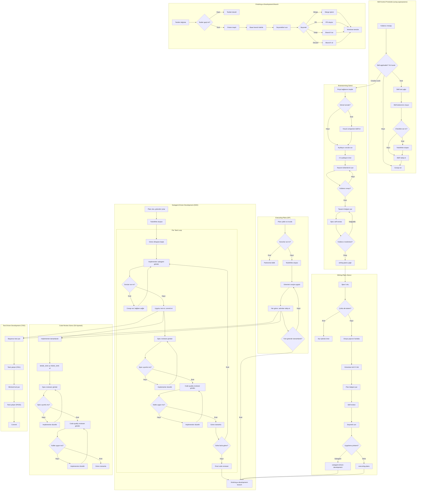

# Superpowers Tüm Süreçler - Kapsamlı Mermaid Grafiği



## Süreç Açıklamaları

### 1. Skill Kontrol Protokolü
`using-superpowers` skill'i, "1% kuralı" olarak bilinen zorunlu bir protokol uygular. Eğer bir skill'in geçme ihtimali %1 bile olsa, ajan mutlaka o skill'i çağırmalıdır. [1](#2-0) 

### 2. Brainstorming Süreci
Fikirleri tasarıma dönüştürür. Hard-gate mekanizması ile tasarım onayı olmadan hiçbir implementation skill'ine geçiş yapmaz. [2](#2-1)  Tasarım belgesi `docs/superpowers/specs/YYYY-MM-DD-<topic>-design.md` konumuna kaydedilir. [3](#2-2) 

### 3. Writing-Plans Süreci
Onaylanmış tasarımı uygulama planına dönüştürür. Her görev 2-5 dakikalık adımlara bölünür ve tam dosya yolları, tam kod, doğrulama adımları içerir. [4](#2-3)  Plan belgesi `docs/superpowers/plans/YYYY-MM-DD-<feature-name>.md` konumuna kaydedilir. [5](#2-4) 

### 4. Subagent-Driven Development
Her görev için taze bir alt-ajan gönderir ve iki aşamalı inceleme yapar (spec compliance, sonra code quality). Sürekli yürütme ilkesi ile görevler arasında durulmaz. [6](#2-5) 

### 5. Executing-Plans
Subagent desteği olmayan platformlar için toplu uygulama yöntemi. Görevleri sırayla uygular ve doğrulamaları çalıştırır. [7](#2-6) 

### 6. Code Review Süreci
İki aşamalı inceleme: önce spec compliance, sonra code quality. BASE_SHA/HEAD_SHA protokolü ile inceleme kapsamı belirlenir. [8](#2-7) 

### 7. Finishing-a-Development-Branch
Tüm görevler tamamlandıktan sonra testleri doğrular, seçenekleri sunar (merge/PR/keep/discard) ve worktree'i temizler. [9](#2-8) 

### 8. Test-Driven Development
RED-GREEN-REFACTOR döngüsü: önce başarısız test yaz, başarısız olduğunu gör, minimal kod yaz, geçtiğini gör, commit yap. [10](#2-9) 

## Notes

- **Temel İş Akışı:** 7 zorunlu skill'den oluşur: brainstorming, using-git-worktrees, writing-plans, subagent-driven-development/executing-plans, test-driven-development, requesting-code-review, finishing-a-development-branch. [11](#2-10) 
- **Platform Uyarlama:** Skill'ler Claude Code araç isimleriyle yazılır ancak diğer platformlar için bir eşleştirme katmanı vardır (Copilot CLI, Codex, Gemini CLI). [12](#2-11) 
- **Model Seçimi:** Subagent-driven development'da görev karmaşıklığına göre model seçilir (mekanik → ucuz model, entegrasyon → standart model, mimari → yetenekli model). [13](#2-12) 

Wiki pages you might want to explore:
- [Glossary (obra/superpowers)](/wiki/obra/superpowers#11)
- [Code Review Process (obra/superpowers)](/wiki/obra/superpowers#6.8)

### Citations

**File:** skills/using-superpowers/SKILL.md (L10-16)
```markdown
<EXTREMELY-IMPORTANT>
If you think there is even a 1% chance a skill might apply to what you are doing, you ABSOLUTELY MUST invoke the skill.

IF A SKILL APPLIES TO YOUR TASK, YOU DO NOT HAVE A CHOICE. YOU MUST USE IT.

This is not negotiable. This is not optional. You cannot rationalize your way out of this.
</EXTREMELY-IMPORTANT>
```

**File:** skills/using-superpowers/SKILL.md (L38-40)
```markdown
## Platform Adaptation

Skills use Claude Code tool names. Non-CC platforms: see `references/copilot-tools.md` (Copilot CLI), `references/codex-tools.md` (Codex) for tool equivalents. Gemini CLI users get the tool mapping loaded automatically via GEMINI.md.
```

**File:** skills/brainstorming/SKILL.md (L12-14)
```markdown
<HARD-GATE>
Do NOT invoke any implementation skill, write any code, scaffold any project, or take any implementation action until you have presented a design and the user has approved it. This applies to EVERY project regardless of perceived simplicity.
</HARD-GATE>
```

**File:** skills/brainstorming/SKILL.md (L111-111)
```markdown
- Write the validated design (spec) to `docs/superpowers/specs/YYYY-MM-DD-<topic>-design.md`
```

**File:** skills/writing-plans/SKILL.md (L18-18)
```markdown
**Save plans to:** `docs/superpowers/plans/YYYY-MM-DD-<feature-name>.md`
```

**File:** skills/writing-plans/SKILL.md (L63-104)
```markdown
## Task Structure

````markdown
### Task N: [Component Name]

**Files:**
- Create: `exact/path/to/file.py`
- Modify: `exact/path/to/existing.py:123-145`
- Test: `tests/exact/path/to/test.py`

- [ ] **Step 1: Write the failing test**

```python
def test_specific_behavior():
    result = function(input)
    assert result == expected
```

- [ ] **Step 2: Run test to verify it fails**

Run: `pytest tests/path/test.py::test_name -v`
Expected: FAIL with "function not defined"

- [ ] **Step 3: Write minimal implementation**

```python
def function(input):
    return expected
```

- [ ] **Step 4: Run test to verify it passes**

Run: `pytest tests/path/test.py::test_name -v`
Expected: PASS

- [ ] **Step 5: Commit**

```bash
git add tests/path/test.py src/path/file.py
git commit -m "feat: add specific feature"
```
````
```

**File:** skills/subagent-driven-development/SKILL.md (L14-14)
```markdown
**Continuous execution:** Do not pause to check in with your human partner between tasks. Execute all tasks from the plan without stopping. The only reasons to stop are: BLOCKED status you cannot resolve, ambiguity that genuinely prevents progress, or all tasks complete. "Should I continue?" prompts and progress summaries waste their time — they asked you to execute the plan, so execute it.
```

**File:** skills/subagent-driven-development/SKILL.md (L89-103)
```markdown
## Model Selection

Use the least powerful model that can handle each role to conserve cost and increase speed.

**Mechanical implementation tasks** (isolated functions, clear specs, 1-2 files): use a fast, cheap model. Most implementation tasks are mechanical when the plan is well-specified.

**Integration and judgment tasks** (multi-file coordination, pattern matching, debugging): use a standard model.

**Architecture, design, and review tasks**: use the most capable available model.

**Task complexity signals:**
- Touches 1-2 files with a complete spec → cheap model
- Touches multiple files with integration concerns → standard model
- Requires design judgment or broad codebase understanding → most capable model

```

**File:** skills/executing-plans/SKILL.md (L16-38)
```markdown
## The Process

### Step 1: Load and Review Plan
1. Read plan file
2. Review critically - identify any questions or concerns about the plan
3. If concerns: Raise them with your human partner before starting
4. If no concerns: Create TodoWrite and proceed

### Step 2: Execute Tasks

For each task:
1. Mark as in_progress
2. Follow each step exactly (plan has bite-sized steps)
3. Run verifications as specified
4. Mark as completed

### Step 3: Complete Development

After all tasks complete and verified:
- Announce: "I'm using the finishing-a-development-branch skill to complete this work."
- **REQUIRED SUB-SKILL:** Use superpowers:finishing-a-development-branch
- Follow that skill to verify tests, present options, execute choice

```

**File:** skills/requesting-code-review/SKILL.md (L26-30)
```markdown
**1. Get git SHAs:**
```bash
BASE_SHA=$(git rev-parse HEAD~1)  # or origin/main
HEAD_SHA=$(git rev-parse HEAD)
```
```

**File:** skills/finishing-a-development-branch/SKILL.md (L18-38)
```markdown
### Step 1: Verify Tests

**Before presenting options, verify tests pass:**

```bash
# Run project's test suite
npm test / cargo test / pytest / go test ./...
```

**If tests fail:**
```
Tests failing (<N> failures). Must fix before completing:

[Show failures]

Cannot proceed with merge/PR until tests pass.
```

Stop. Don't proceed to Step 2.

**If tests pass:** Continue to Step 2.
```

**File:** README.md (L163-177)
```markdown
1. **brainstorming** - Activates before writing code. Refines rough ideas through questions, explores alternatives, presents design in sections for validation. Saves design document.

2. **using-git-worktrees** - Activates after design approval. Creates isolated workspace on new branch, runs project setup, verifies clean test baseline.

3. **writing-plans** - Activates with approved design. Breaks work into bite-sized tasks (2-5 minutes each). Every task has exact file paths, complete code, verification steps.

4. **subagent-driven-development** or **executing-plans** - Activates with plan. Dispatches fresh subagent per task with two-stage review (spec compliance, then code quality), or executes in batches with human checkpoints.

5. **test-driven-development** - Activates during implementation. Enforces RED-GREEN-REFACTOR: write failing test, watch it fail, write minimal code, watch it pass, commit. Deletes code written before tests.

6. **requesting-code-review** - Activates between tasks. Reviews against plan, reports issues by severity. Critical issues block progress.

7. **finishing-a-development-branch** - Activates when tasks complete. Verifies tests, presents options (merge/PR/keep/discard), cleans up worktree.

**The agent checks for relevant skills before any task.** Mandatory workflows, not suggestions.
```
